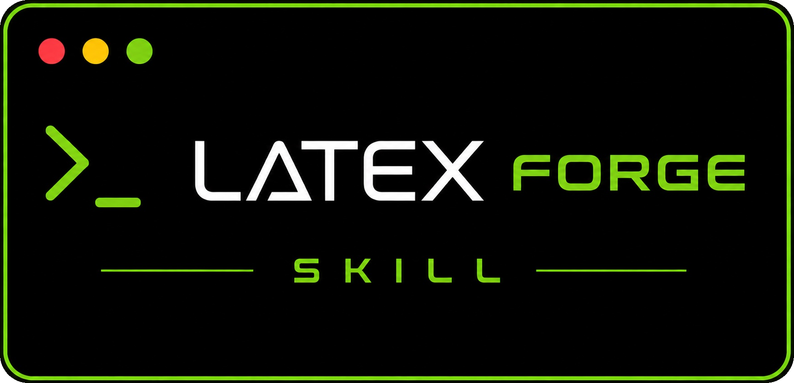

<p align="right"><a href="./README.md">English</a> | <b>Français</b></p>

<p align="center">
  
</p>

<p align="center">
  <b>Décrivez le document dont vous avez besoin à Claude. Il génère, rédige et compile le LaTeX pour vous.</b>
</p>

<p align="center">
  <a href="LICENSE"></a>
  <a href="https://github.com/thmsgo18/latex-forge"></a>
  
</p>

<p align="center">
  <a href="#cest-quoi">Installation</a> •
  <a href="#ce-que-ça-fait">Ce que ça fait</a> •
  <a href="#exemple">Exemple</a> •
  <a href="#fonctionnement">Fonctionnement</a> •
  <a href="#projets-liés">Projets liés</a>
</p>

---

## C'est quoi ?

Un skill [Claude](https://claude.com) qui permet de piloter [LaTeX Forge](https://github.com/thmsgo18/latex-forge)
entièrement depuis une conversation : demandez un rapport de projet, un CV,
un chapitre de thèse, un article, un poster ou tout autre document, et Claude
génère un projet prêt à écrire depuis la [galerie de templates](https://github.com/thmsgo18/latex-forge-gallery),
remplit votre page de garde et votre contenu, compile le PDF, et exporte le
résultat pour le rendu.

Ce skill ne duplique pas l'écosystème LaTeX Forge : il apprend à Claude à
utiliser la CLI `latex-forge`, à choisir un template parmi les 80+
disponibles, et à suivre le fichier `AGENTS.md` propre à chaque projet généré.

## Installation

C'est un [skill Claude Code](https://docs.claude.com/en/docs/claude-code/skills)
classique : un dossier contenant un `SKILL.md` que Claude charge
automatiquement quand c'est pertinent.

**Skill personnel** (disponible dans tous vos projets) :

```bash
git clone https://github.com/thmsgo18/latex-forge-skill.git /tmp/latex-forge-skill
mkdir -p ~/.claude/skills
cp -r /tmp/latex-forge-skill/latex-forge ~/.claude/skills/
rm -rf /tmp/latex-forge-skill
```

**Skill de projet** (uniquement pour le dépôt courant) :

```bash
git clone https://github.com/thmsgo18/latex-forge-skill.git /tmp/latex-forge-skill
mkdir -p .claude/skills
cp -r /tmp/latex-forge-skill/latex-forge .claude/skills/
rm -rf /tmp/latex-forge-skill
```

C'est tout, aucune configuration nécessaire. Le skill installe lui-même la CLI
`latex-forge` (via `pipx`) la première fois qu'il en a besoin.

## Ce que ça fait

- **Choisit le bon template** : templates intégrés (rapport de projet,
  article de recherche, CV...) ou l'un des 80+ templates de la galerie
  (thèses, rapports de stage, comptes rendus de TP, articles de conférence,
  posters, slides beamer, lettres, livres...)
- **Génère le projet** avec `latex-forge create` : arborescence, styles
  intégrés, bibliographie, prévisualisation PDF dans VS Code, le tout
  autonome
- **Lit le `AGENTS.md`** du projet avant toute modification — chaque projet
  généré embarque sa propre notice avec sa structure, ses commandes
  personnalisées et les erreurs courantes
- **Remplit la page de garde** (titre, auteurs, université, encadrant,
  contacts...) à partir de ce que vous lui indiquez
- **Rédige le contenu** : sections, références bibliographiques, figures,
  annexes, à partir de vos notes, brouillons ou données
- **Compile et corrige les erreurs** avec `latex-forge build` / `watch`
- **Exporte** les sources et le PDF final dans une archive prête à rendre
  avec `latex-forge export`

## Exemple

```
Vous : J'ai besoin d'un rapport de projet pour mon Master, style AFNOR/ISO,
       en français. Le titre est "Plateforme de gestion documentaire
       collaborative", trois auteurs : moi, Alice Martin et Baptiste Durand,
       encadrés par la Pr. Sophie Lefebvre. Voici mes notes sur
       l'architecture et les tests : ...

Claude : [crée le projet à partir de project-report-fr, remplit
         frontmatter/metadata.tex, rédige sections/architecture.tex et
         sections/tests.tex à partir de vos notes, compile et signale
         les éventuelles erreurs LaTeX]
```

## Fonctionnement

1. Vérifie que la CLI `latex-forge` est installée (`pipx install latex-forge`
   si besoin)
2. Choisit un template — intégré, ou installé depuis la
   [galerie](https://github.com/thmsgo18/latex-forge-gallery)
3. `latex-forge create --name ... --template ... --output ...`
4. Lit le `AGENTS.md` généré — le guide de référence pour ce projet
5. Remplit `frontmatter/metadata.tex` et rédige le contenu dans `sections/`
6. `latex-forge build`, corrige les erreurs LaTeX, recommence
7. `latex-forge export` pour une archive propre, prête à rendre

Les instructions complètes et le catalogue de templates sont dans
[`latex-forge/SKILL.md`](latex-forge/SKILL.md) et
[`latex-forge/references/`](latex-forge/references/).

## Prérequis

- [Claude Code](https://docs.claude.com/en/docs/claude-code) (ou tout client
  Claude supportant les skills)
- Python 3.10+ et [pipx](https://pipx.pypa.io) (le skill installe
  `latex-forge` lui-même si nécessaire)
- Une distribution LaTeX pour compiler en local — `latex-forge setup --install-tex`
  en installe une si besoin

## Projets liés

- [**latex-forge**](https://github.com/thmsgo18/latex-forge) : la CLI pilotée par ce skill : génération, build, watch, export de projets LaTeX
- [**latex-forge-gallery**](https://github.com/thmsgo18/latex-forge-gallery) : la galerie de templates curée (80+) et son [site web](https://thmsgo18.github.io/latex-forge-gallery/)
- [**latex-forge-vscode**](https://github.com/thmsgo18/latex-forge-vscode) : l'extension VS Code compagnon : créer des projets et parcourir la galerie sans terminal

## Auteur

Créé par [thmsgo18](https://github.com/thmsgo18)
